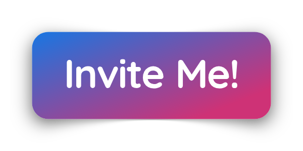

# Enlister Bot
A discord bot ready to protect your server from raiders, spammers and trollers!

### How do I use it?
Info
# Selfhosting the bot
### Introduction
1. Breathe air.
### Why do I need this stupid bot?
Well it's just a bot to protect your discord server. Raiders come on my servers alot and Dyno, or any other moderation bot was a pain to setup and I didn't have time to, that's why I made Enlister bot. I am attempting to make this bot the most easiest/simple, effective and always online bot. If you want to help me with this project, dm me on discord, Pie#9196. Basically I'll be making a electron application, and a express.js website. I already know electron so express should be also easy.
### I still don't want the bot, can this bot do anything else useful at all?
Not yet. We are still focusing on protecting your server(s) as our main goal, we will then move over to music and so on.
### Can I fork this bot and suggest edits?
Sure.
### When automod?
Soon™.
### Whomst made this bot again?
Currently just me. Pie#9196. After the kind of success of PieBot and death as well, I finally decided to put my fingers and sweat into a different bot which will help servers with moderation, a lightweight, simple, and easy to use bot. That is my goal with this bot. I work everyday after school to improve on this bot. Be aware that this is still a very early bot and is hosted locally on my own PC. I'll be moving to servers later on hopefully but for now, keeping discord servers secure is my main goal (oh but pie there's already great bots) they don't do the things I want them to do though, either they are focused morely on music and so on or they can't manage my server when I am away, for me, moderation comes first. 
# Need help with the bot? Contact me!
### Email
[piebotdiscord@gmail.com](mailto:piebotdiscord@gmail.com "Email me!")
### Discord Server
[discord.gg/oasdkosap](https://discord.gg/oasdkosap "Join the Discord Server")
### Twitter
[twitter.com/piebotdiscord](https://twitter.com/piebotdiscord "Tweet at me!")
# Development Milestones
Version # | Codename | Release Date
:---: | :---: | :---:
1 | `undefined` | TBA
### V1 `undefined`
Info about V1.
> Help goes here.
