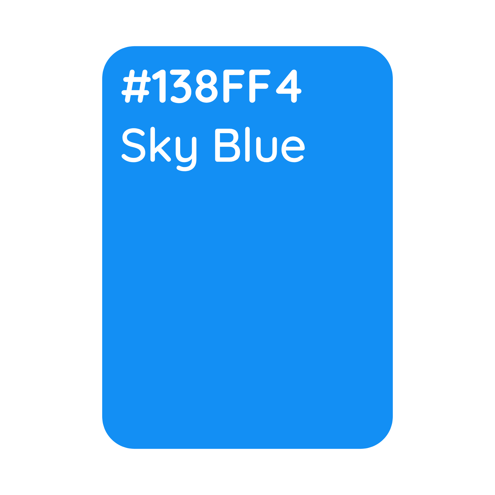
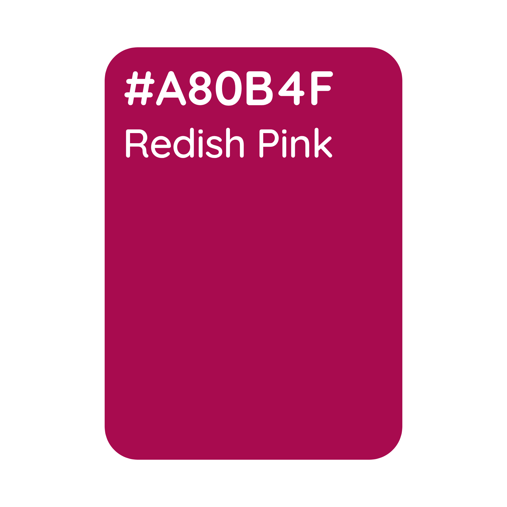
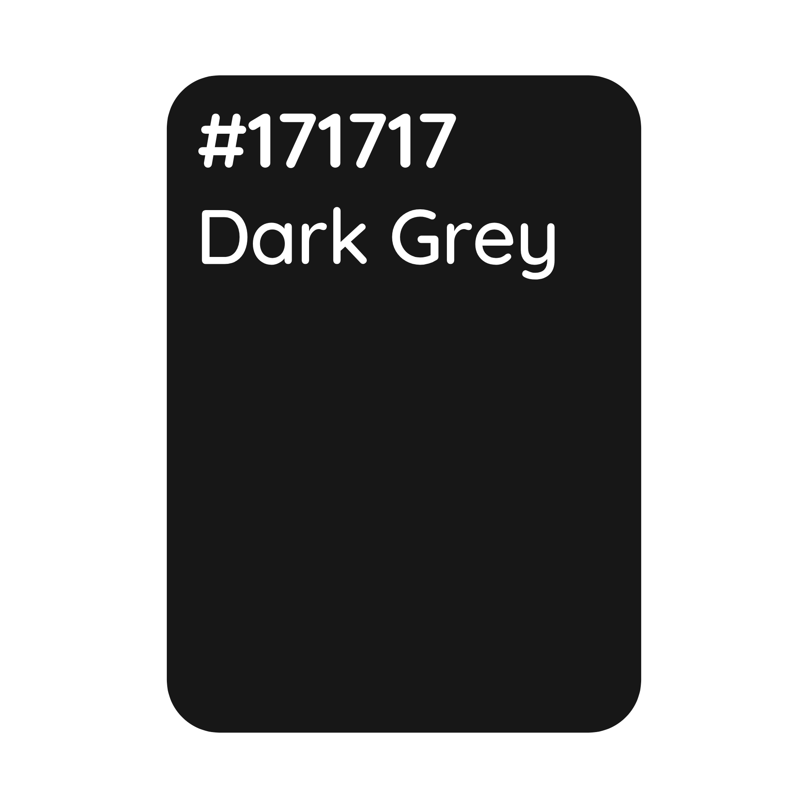
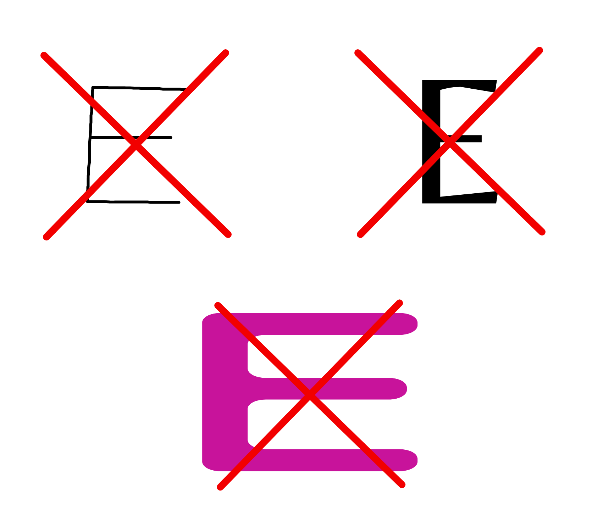

<h1 align="center">Branding Guidelines</h1>

The E must be not remade or modified to something which doesn't look like the original assets unless given permission.
 If you do modify it, it must look like the examples below.

<h2 align="center">Colors</h2>

<h2 align="center">"E"</h2>

<h1 align="center">Formats</h1>

<a align="center" href="https://github.com/PieBotDevs/enlister/tree/master/branding/img">PNG</a> | <a align="center" href="https://github.com/PieBotDevs/enlister/tree/master/branding/svg">SVG</a> | <a align="center" href="https://github.com/PieBotDevs/enlister/tree/master/branding/gvdesign">GVDESIGN (Gravit)</a>

<h1 align="center">Examples of the no-go zone with the brand.</h1>

